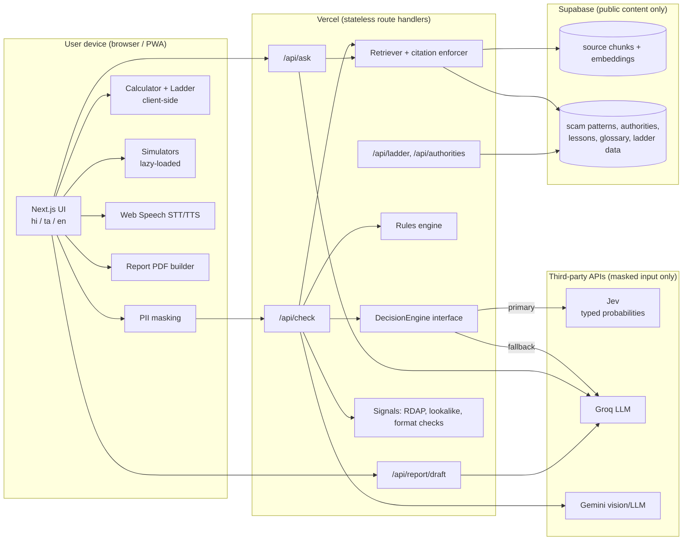
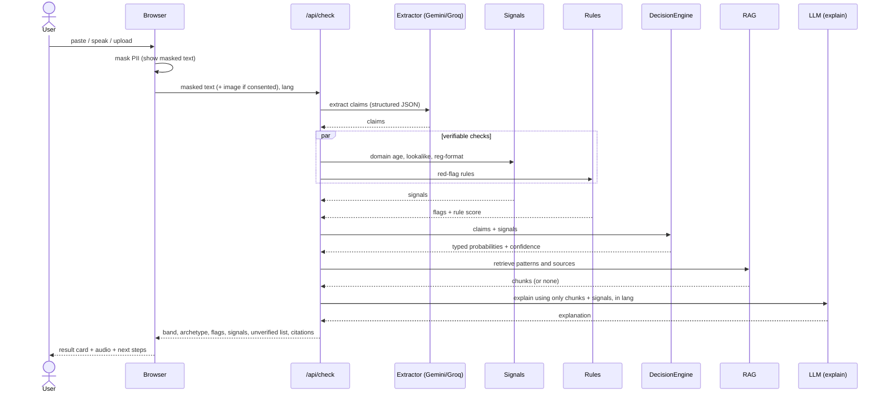
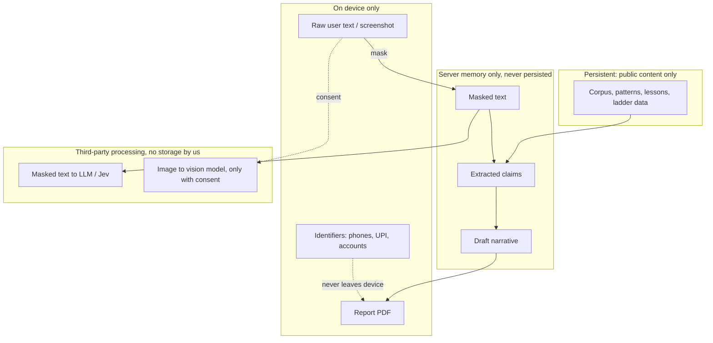
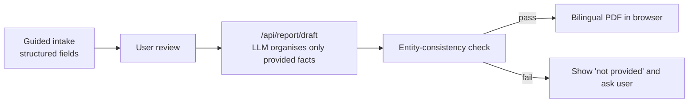
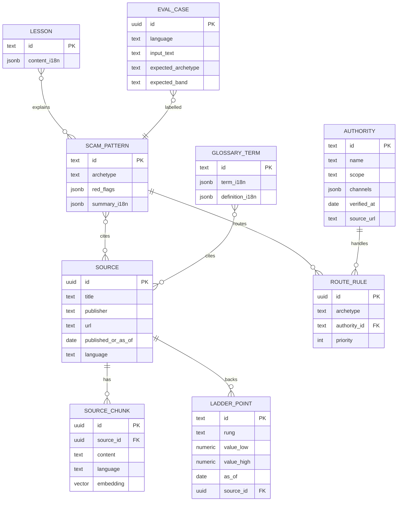

# 03: Technical Design Document (TDD)

**Status:** Draft v0.1 · Diagrams use Mermaid (render in the IDE's Markdown preview or any Mermaid viewer).

## 1. Principles

1. **Stateless for user content.** The server never stores messages, screenshots, identifiers or reports.
2. **Deterministic first, probabilistic second, generative last.** Maths and rules decide facts; a typed decision layer scores uncertainty; the LLM only explains from retrieved sources.
3. **Swap-able engines.** Decision and LLM providers sit behind interfaces so a provider outage or missing access doesn't block the demo.
4. **Low-bandwidth by default.** Small bundles, lazy-loaded simulators, text-first UI.

## 2. Tech stack

| Layer | Choice | Notes |
|---|---|---|
| Frontend | Next.js (App Router) + TypeScript + React | PWA-ready; route-level code splitting |
| Styling | Tailwind CSS | Purge unused; system fonts plus subset Noto Sans Tamil/Devanagari (woff2) |
| i18n | `next-intl` (or equivalent) | `en`, `hi`, `ta` catalogs |
| Backend | Next.js route handlers (REST, Node runtime) | No separate server |
| Decision engine | **Jev (TypeSafe)** via adapter; fallback: Groq with JSON-schema output | Interface in §6 |
| LLM (explain) | Groq (fast text) and Gemini (vision/OCR, multilingual) | Keys in env vars; never exposed to the client |
| Embeddings | Multilingual embedding model (TBD in hours 0–5) | Test Tamil/Hindi retrieval |
| Database | Supabase Postgres + `pgvector` | **Public content only** (see §5) |
| Voice | Web Speech API (STT) and `speechSynthesis` (TTS) | Device-dependent; graceful fallback |
| PDF | Browser-side (`pdf-lib` or print-to-PDF) | Needs Tamil/Devanagari font embedding |
| Hosting | Vercel | Docker only for reproducible local run |
| Testing | Vitest (unit) + eval script (accuracy/calibration) | |

## 3. System architecture



## 4. Key flows

### 4.1 Scam Check (sequence)



### 4.2 Privacy boundaries



**Known limitation:** text inside screenshots cannot be masked client-side without heavy OCR (bad for bandwidth). Mitigation: explicit consent, no storage, text-paste alternative, crop tool (P1).

### 4.3 Victim record



## 5. Data model (Supabase, public content only)



No tables for users, messages, reports, or identifiers. Row-level security: public read-only for content tables; writes only from seed scripts.

## 6. Interfaces and contracts

### 6.1 DecisionEngine

```ts
export type Lang = 'en' | 'hi' | 'ta';

export type Archetype =
  | 'DOUBLING_SCHEME' | 'COPY_TRADING' | 'COURSE_FINFLUENCER'
  | 'CRYPTO_STAKING_MINING' | 'FAKE_TRADING_APP_OR_PORTAL'
  | 'FAKE_ADVISORY_OR_REG_CLAIM' | 'PUMP_AND_DUMP_GROUP'
  | 'REMOTE_ACCESS_SCAM' | 'FAKE_IPO_OR_ALLOTMENT' | 'OTHER_OR_NONE';

export type RiskBand = 'HIGH' | 'MEDIUM' | 'LOW_SIGNALS' | 'CANNOT_VERIFY';

export interface ExtractedClaims {
  promisedReturns: { multiple?: number; durationDays?: number; guaranteed?: boolean }[];
  urgencyPhrases: string[];
  requests: ('OTP' | 'APP_INSTALL' | 'PAYMENT' | 'GROUP_JOIN' | 'PERSONAL_ACCOUNT')[];
  registrationClaims: string[];
  urls: string[];
  handles: string[];
}

export interface Signal { id: string; label: string; value: string; sourceUrl?: string; asOf?: string }

export interface DecisionInput { maskedText: string; claims: ExtractedClaims; signals: Signal[]; lang: Lang }

export interface Decision {
  archetype: Record<Archetype, number>;  // probabilities, sum ≈ 1
  riskBand: Record<RiskBand, number>;    // probabilities, sum ≈ 1
  urgency: number;                       // 0..1
  confidence: number;                    // 0..1
  engine: 'jev' | 'llm-fallback' | 'rules-only';
}

export interface DecisionEngine { decide(input: DecisionInput): Promise<Decision>; }
```

Engine selection (env `DECISION_ENGINE=jev|fallback|rules`): try Jev with a short timeout → on error/timeout use fallback → on error use rules-only (`confidence` capped, banner "limited mode"). **Measure every engine on the eval set; do not assume calibration.**

### 6.2 REST endpoints

| Method + Path | Request | Response |
|---|---|---|
| `POST /api/check` | `{ maskedText, imageBase64?, consentImage?: boolean, lang }` | `{ band, archetype: {top, prob}, confidence, flags[], signals[], unverified[], explanation, citations[], nextSteps[], engine }` |
| `POST /api/ask` | `{ question, lang }` | `{ answer, citations[] }` or `{ answer: null, reason: 'NO_SOURCE' }` |
| `POST /api/report/draft` | `{ fields: IntakeFields, lang }` | `{ narrativeLang, narrativeEn, missing[] }` |
| `GET /api/ladder` | none | `{ rungs[], asOf, sources[] }` |
| `GET /api/authorities?archetype=…` | query | `{ authorities[] }` (only verified channels) |

Errors: `{ error: { code, message } }` with 4xx for validation, 429 for rate-limit, 503 with `{ engine: 'rules-only' }` when degraded. Rate-limit per IP in memory (no storage of content).

### 6.3 RAG pipeline

1. **Ingest (offline script):** fetch/prepare public official pages and original summaries → chunk (~300–500 tokens) → embed → store with `source_id`.
2. **Retrieve:** embed query (multilingual) → top-k (k=5) by cosine similarity → drop below threshold `τ` (tuned on the eval set).
3. **Generate:** prompt includes only retrieved chunks + signals; instruct "answer only from these; otherwise say you can't verify"; output language = `lang`.
4. **Enforce:** server checks that the answer references at least one chunk id; if not, return the fallback message.

## 7. Repo structure

```
/
├─ docs/                      # these documents
├─ data/
│  ├─ ladder.json             # with source_url + as_of
│  ├─ authorities.json        # with verified_at
│  ├─ scam_patterns.json
│  └─ eval_cases.json         # 30 labelled cases (en/hi/ta)
├─ locales/{en,hi,ta}.json
├─ scripts/
│  ├─ ingest.ts               # corpus → chunks → embeddings
│  ├─ seed.ts                 # patterns, lessons, glossary
│  └─ eval.ts                 # accuracy + calibration report
├─ src/
│  ├─ app/                    # routes: /, /check, /calculator, /learn, /report, /ask
│  ├─ app/api/{check,ask,report,ladder,authorities}/route.ts
│  ├─ lib/{mask,rules,signals,decision,rag,llm,i18n,calc}.ts
│  ├─ components/
│  └─ simulators/             # lazy-loaded
├─ Dockerfile
└─ .env.example
```

## 8. Non-functional targets

| Area | Target |
|---|---|
| Initial JS (main flow) | < 150 KB gzipped; simulators and PDF code lazy-loaded |
| Time to first result | < 5 s on throttled 4G (check flow, text only) |
| Decision latency | < 1 s typical (engine call), with 3 s timeout then fallback |
| Accessibility | Semantic HTML, large touch targets, contrast AA, text alternatives for charts and animations |
| Fonts | Subset Noto Sans (Tamil, Devanagari); `font-display: swap`; system fallback |
| Devices | Mid-range Android Chrome as the reference |
| Security | API keys server-side only; CSP; no third-party trackers; no cookies required; input length limits |
| Logging | No user content in logs; log only status codes, engine used, latency |

## 9. Evaluation plan

- `data/eval_cases.json`: 30 cases (10 per language): ~20 scam archetypes, ~5 benign/educational messages, ~5 ambiguous.
- `scripts/eval.ts` reports: archetype top-1 accuracy, high-risk recall, false-alarm rate on benign cases, calibration table (confidence bins vs accuracy), per-engine comparison (Jev vs fallback vs rules-only).
- Run after every change to prompts, rules, or thresholds. Put the table in the deck.

## 10. Deployment

- Vercel project with env vars: `DECISION_ENGINE`, `JEV_API_KEY`, `GROQ_API_KEY`, `GEMINI_API_KEY`, `SUPABASE_URL`, `SUPABASE_ANON_KEY` (read-only), `SUPABASE_SERVICE_KEY` (seed scripts only, never in the deployed app).
- `Dockerfile` runs the app locally with the same env contract.
- Record the demo video from the deployed build **and** keep a pre-recorded fallback.

## 11. Build plan (maps to PRD §9)

| Hours | Tasks |
|---|---|
| 0–5 | Repo + CI skeleton; data collection (`ladder`, `authorities`); corpus ingest; eval set; embedding and Jev decisions; Tamil/Hindi OCR and retrieval smoke test |
| 5–14 | `lib/mask`, `lib/calc`, M1 + M2 UI; rules engine; `/api/check` with fallback engine |
| 14–22 | Jev adapter (if access), signals, router (M4), result card, victim record (M5) |
| 22–32 | RAG bot (M7), simulator M6, language packs, voice (M8), lessons-lite (M11) |
| 32–40 | M9, M10, eval run + threshold tuning, bundle audit, deploy, device test |
| **40** | **Freeze** |
| 40–50 | Video, deck (reuse these diagrams), submission, buffer |

## 12. Release gate: guardrail checklist

- [ ] No text anywhere recommends, ranks, or predicts a specific instrument, broker, or platform.
- [ ] No ads, affiliate links, upsells or paid-tier placeholders in UI, deck, or video.
- [ ] No SMS/OTP access; no persistent storage of user content (verify DB schema and logs).
- [ ] Masking verified: inspect network tab, no raw identifiers in requests.
- [ ] No specific company/coin/person named as a scam in the product.
- [ ] Every number traceable to `data/` with source and date.
- [ ] Every helpline/URL has `verified_at`.
- [ ] Bot returns "can't verify" for out-of-corpus questions and refuses advice in all three languages.
- [ ] Lowest risk band never says "safe".
- [ ] Privacy notice and "limited mode" banner present.

## 13. Open technical questions

1. Does Jev access arrive in time, and what is its latency from India? (Fallback is mandatory either way.)
2. Which multilingual embedding model gives acceptable Tamil/Hindi retrieval?
3. Is browser-side PDF with Tamil/Devanagari fonts reliable on the reference device? (Fallback: print-to-PDF stylesheet.)
4. Do RDAP lookups work reliably for the TLDs we expect? (Fallback: cached results for demo cases, with "live lookup unavailable" shown when offline.)
