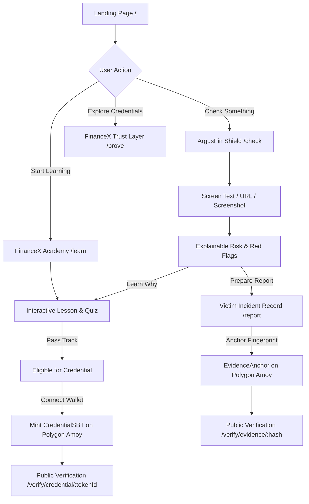

# FinanceX Unified Product Journey Architecture

## 1. Executive Summary
FinanceX unifies three core capabilities into a single seamless user experience:
1. **LEARN:** FinanceX Academy (26 lessons, 4 tracks, AI Tutor, quizzes, simulators).
2. **PROTECT:** ArgusFin Shield (Explainable scam detection, OCR image screening, reality calculators).
3. **PROVE:** FinanceX Trust Layer (Soulbound Credentials, evidence fingerprint anchoring, ScamRegistry).

The user understands within seconds:  
**FinanceX helps me LEARN financial concepts, PROTECT myself from financial scams, and PROVE my learning achievements and evidence integrity.**

---

## 2. Canonical User Journey

---

## 3. Pillar Seams & Integration Loops

### 3.1 Shield → Learn Loop
When a user scans a suspicious message or screenshot in ArgusFin Shield (`/check`), the decision engine classifies the risk band and top archetype. The result screen presents:
1. *What We Observed*
2. *Why It May Matter* (Potential Risk Signals)
3. *What We Cannot Verify*
4. *What You Can Do Next*
5. *Learn More* → Directly routes to the specific Academy lesson covering that fraud archetype (e.g. `copy-trading`, `task-scams`, `cagr`).
6. *Prepare Report* → Directly routes to `/report`.

### 3.2 Learn → Credential Loop
As a user completes lessons and passes quizzes in FinanceX Academy (`/learn`), the progress engine tracks milestone completion. When a track is completed:
1. The user earns **Credential Eligibility**.
2. The UI renders a **Claim Web3 Credential** action.
3. Upon explicit wallet signature, `CredentialSBT.sol` mints a non-transferable Soulbound Token on Polygon Amoy testnet.
4. Independent verification is accessible via `/verify/credential/[tokenId]`.

### 3.3 Report → Prove Loop
When a user prepares an incident record in `/report`:
1. The canonical serializer generates a privacy-masked, key-sorted evidence packet.
2. The user can optionally select **Anchor Evidence Fingerprint on Polygon Amoy**.
3. `EvidenceAnchor.sol` records the SHA-256 digest on-chain.
4. Independent verification is accessible via `/verify/evidence/[hash]`.

---

## 4. Deterministic Recommendation Engine

Located in `src/lib/financeX/journey/recommendation.ts`:
- **Inputs:** Completed lessons, latest Shield archetype, current track.
- **Outputs:** Next Academy lesson, relevant resilience lesson, interactive simulator, and credential eligibility status.
- **Safety Guarantee:** 100% explainable rules. Zero LLM calls, zero user behavioral profiling.

---

## 5. Trust Center & Safety Language

Located in `/trust`:
- Plain-language explanation of privacy gates, client-side regex masking, grounded regulatory data sources, and Web3 blockchain proof boundaries.
- Strictly enforces non-defamatory terminology (`observed signal`, `potential risk`, `needs verification`, `cannot verify`).
