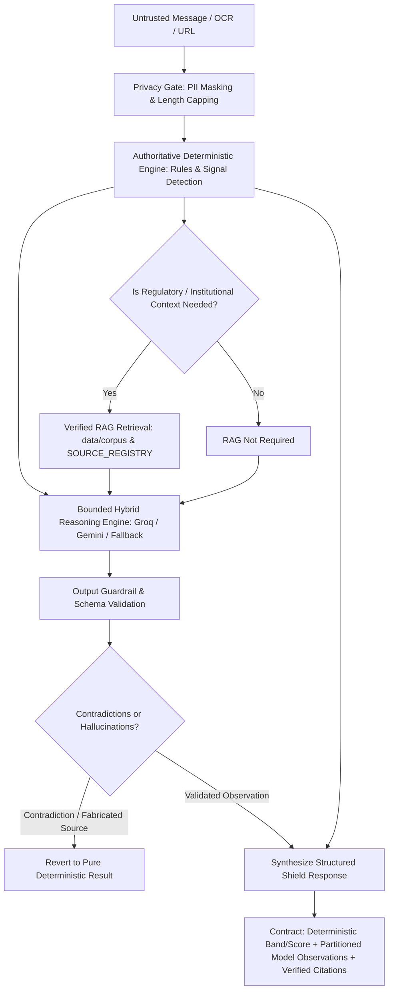

# FinanceX Phase 4.1 — Hybrid AI Architecture

## 1. System Overview

FinanceX Phase 4.1 integrates bounded open-world pattern reasoning while strictly preserving the authoritative deterministic Shield risk engine, verified regulatory RAG provenance, and strict client-side privacy controls.



## 2. Authority Boundaries

1. **Deterministic Authority**:
   - The numerical score $[0, 100]$ and risk band (`HIGH`, `MEDIUM`, `LOW_SIGNALS`, `CANNOT_VERIFY`) are calculated **exclusively** by the deterministic rule engine and score breakdown calculator in [`src/lib/scam/explanation.ts`](file:///d:/ArgusFin/src/lib/scam/explanation.ts).
   - The model is prohibited from altering, calculating, or overwriting risk scores or risk bands.
2. **Dual-Compartment Explanations**:
   - **Verified Findings Compartment**: Deterministic signals, exact supporting text snippets, rule citations, and verified regulatory circular links.
   - **Contextual AI Observations Compartment**: Non-authoritative plain-language interpretation explaining scam tactics and social engineering mechanics.
3. **Fail-Closed Fallback**:
   - If an external LLM times out (2500ms limit), errors, or returns non-compliant JSON, the pipeline immediately falls back to `getDeterministicHybridFallback`.

## 3. Core Modules

| Module | Location | Purpose |
| :--- | :--- | :--- |
| `HybridReasoningService` | [`src/lib/ai/hybridReasoning.ts`](file:///d:/ArgusFin/src/lib/ai/hybridReasoning.ts) | Sandboxed LLM caller with Zod validation, timeout, citation quarantine, and fallback |
| `Shield Orchestrator` | [`src/lib/scam/analyze.ts`](file:///d:/ArgusFin/src/lib/scam/analyze.ts) | Executes privacy gate, rules, RAG gate, and hybrid reasoning layer |
| `Explanation Builder` | [`src/lib/scam/explanation.ts`](file:///d:/ArgusFin/src/lib/scam/explanation.ts) | Localized score breakdown, signal translations (`en`, `hi`, `ta`), and dual-compartment assembly |
| `Open-World Behavior` | [`src/lib/detector/openWorld.ts`](file:///d:/ArgusFin/src/lib/detector/openWorld.ts) | Unicode-safe behavioral extractor for unseen scams, task fraud, and recovery scams |
| `API Contract` | [`src/app/api/check/route.ts`](file:///d:/ArgusFin/src/app/api/check/route.ts) | Public endpoint exposing deterministic findings and `hybridReasoning` payload |

## 4. Response Contract

```typescript
export interface AnalysisResult {
  decision: {
    band: 'HIGH' | 'MEDIUM' | 'LOW_SIGNALS' | 'CANNOT_VERIFY';
    archetype: { top: Archetype; prob: number };
    confidence: number;
    engine: string;
  };
  extractedClaims: ExtractedClaims;
  signals: Signal[];
  flags: RuleResult[];
  explanation: GroundedExplanation;
  structuredExplanation: RiskAnalysisExplanation;
  statuses: {
    decision: 'DECISION_AVAILABLE' | 'DECISION_DEGRADED' | 'DECISION_UNAVAILABLE';
    rag: 'RAG_FOUND' | 'RAG_NO_SOURCE' | 'RAG_UNAVAILABLE' | 'RAG_NOT_REQUIRED';
    llm: 'LLM_EXPLANATION_AVAILABLE' | 'LLM_EXPLANATION_UNAVAILABLE';
    hybrid: 'SUCCESS' | 'FALLBACK_DETERMINISTIC' | 'REJECTED_CONTRADICTION' | 'TIMEOUT';
  };
  hybridReasoning?: ValidatedHybridReasoningResult;
  limitations: string[];
}
```
