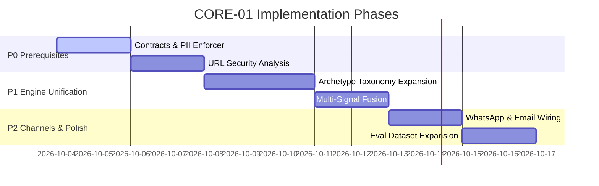

# CORE-01 Implementation Backlog & Prioritization

**Project**: SANGYAN / ArgusFin (Investor Resilience Infrastructure)  
**Task**: CORE-01A Prioritized Implementation Backlog  
**Date**: October 3, 2026  

---

## 1. Backlog Overview

This implementation backlog prioritizes tasks discovered during the **CORE-01A Audit** into 5 distinct categories:
- **P0**: Critical prerequisites required prior to CORE-01 engine unification.
- **P1**: Core deliverables for CORE-01 engine functionality.
- **P2**: Deliverables for multi-channel expansion (WhatsApp, Email).
- **P3**: Quality improvements, UX polish, and extra language lexicons.
- **DEFERRED**: Scope deferred past Phase 5 freeze.

---

## 2. Prioritized Task Items

### P0 — Prerequisites & Guardrail Defenses (Must Complete First)
| ID | Title | Description | Target Files | Priority Rationale |
|---|---|---|---|---|
| `P0-1` | **Unified Multi-Modal Pipeline Contract** | Define standardized `ScamAnalysisRequest` and `ScamAnalysisResponse` TypeScript interfaces to harmonize Web, Telegram, WhatsApp, OCR, and Voice. | `src/lib/detector/types.ts` | Required to avoid duplicate decision types across channels. |
| `P0-2` | **Strict PII Enforcer Middleware** | Enforce mandatory client & server-side PII masking validation prior to LLM or RAG query execution. | `src/lib/privacy/mask.ts` | Enforces Rule 3 (Privacy by Design) across all future channels. |
| `P0-3` | **Lookalike Domain & URL Security Utility** | Implement punycode normalization, confusable domain checker, and SEBI registered portal matcher without external crawling. | `src/lib/url/analyze.ts` | Essential to prevent phishing domain bypasses. |

---

### P1 — CORE-01 Unified Detection Engine Features
| ID | Title | Description | Target Files | Priority Rationale |
|---|---|---|---|---|
| `P1-1` | **Extended Archetype Taxonomy Mapper** | Extend rule evaluator to cover missing target archetypes (e.g. Mule Payments, Remote Access, Task Scam, Advance Fee). | `src/lib/detector/rules.ts`, `src/lib/detector/archetypes.ts` | Expands detection capabilities to full 20+ archetype target taxonomy. |
| `P1-2` | **Unified Multi-Signal Fusion Engine** | Connect text claims, OCR text, voice transcriptions, and URL signals into a unified fusion score. | `src/lib/detector/decision/engine.ts` | Core engine objective for CORE-01. |
| `P1-3` | **Multilingual Lexicon Expansion (TA/HI)** | Add southern regional Tamil copy trading & crypto scam terms to detector lexicons. | `src/lib/detector/lexicons.ts` | Delivers required Tamil Nadu regional financial scam coverage. |

---

### P2 — Channel Expansion & Adapter Integration
| ID | Title | Description | Target Files | Priority Rationale |
|---|---|---|---|---|
| `P2-1` | **WhatsApp Business Webhook Activation** | Wire WhatsApp message parser to unified detection engine; manage token initialization cleanly. | `src/app/api/channels/whatsapp/route.ts` | Enables WhatsApp channel when credentials are configured. |
| `P2-2` | **Email Ingestion Parser Adapter (PLANNED)** | Create mockable email parser route (`/api/channels/email`) for handling pasted email headers & body text. | `src/app/api/channels/email/route.ts` | Completes F12 email ingestion architecture. |

---

### P3 — Quality Improvements & Verification Harness
| ID | Title | Description | Target Files | Priority Rationale |
|---|---|---|---|---|
| `P3-1` | **Expanded Evaluation Dataset Benchmark** | Add 30+ new test cases covering new archetypes and regional Tamil/Hindi text samples. | `data/eval_dataset.json` | Maintains eval precision/recall monitoring. |
| `P3-2` | **Channel Specific Risk Card UX** | Optimize risk output rendering for Telegram MarkdownV2 and WhatsApp text formatting. | `src/lib/channels/formatter.ts` | Delivers clean mobile user experience on chat platforms. |

---

### DEFERRED — Post-Phase 5 Initiatives
| ID | Title | Description | Deferral Rationale |
|---|---|---|---|
| `DEF-1` | Live Web Crawling of Suspicious Domains | Real-time automated crawling of untrusted external domains. | Forbidden under security guidelines; high risk of malware / SSRF. |
| `DEF-2` | Automatic Complaint Filing with Authorities | Direct REST submission of user reports to official police endpoints. | Requires official API partnerships and user signature verification. |

---

## 3. Summary Schedule

