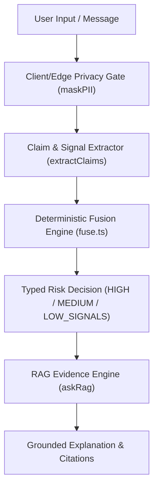

# CORE-01D Implementation Report: RAG Knowledge Grounding & Source Governance

**Project**: SANGYAN / ArgusFin (Investor Resilience Infrastructure)  
**Task**: CORE-01D RAG Knowledge Grounding & Retrieval Evaluation  
**Date**: October 3, 2026  

---

## 1. Executive Summary

In accordance with **TASK CORE-01D**, an auditable, governed RAG grounding layer was established for SANGYAN / ArgusFin. The architecture strictly enforces that **deterministic rules and decision fusion remain authoritative** for risk classification (`HIGH`, `MEDIUM`, `LOW_SIGNALS`, `CANNOT_VERIFY`) and numerical return calculations, while RAG provides verified source-backed context, citations, and educational guidance.

---

## 2. Source Governance & Trust Hierarchy

A formal source registry was created under `data/kb/sources.json` and `src/lib/rag/sources.ts` with explicit provenance metadata and trust tiers:

| Trust Tier | Definition | Example Source | Allowed Usage |
|---|---|---|---|
| **`TIER_1_PRIMARY`** | Official regulatory alerts & advisories | SEBI, RBI Sachet, MHA 1930, DoT Chakshu | Grounded citations & numeric claim verification |
| **`TIER_2_OFFICIAL_EDUCATIONAL`** | Official educational portals & investor guidelines | SEBI Investor Education, RBI Financial Education | Educational context & citations |
| **`TIER_3_SECONDARY_CONTEXT`** | Verified regulatory summaries | Internal KB articles (`data/kb/*.md`) | General context (requires numeric grounding) |
| **`INTERNAL_SYNTHETIC`** | Offline test fixtures | Synthetic test cases | Evaluation harness only (Never in production UI) |

---

## 3. Numeric Claim & Provenance Policy

The system enforces strict provenance for factual numeric claims:
1. **Calculated Values**: Derived deterministically from user-provided inputs via `src/lib/calc.ts`.
2. **Source-Backed Values**: Validated against retrieved `TIER_1_PRIMARY` sources via `validateNumericClaimProvenance()`.
3. **Ungrounded Numerical Claims**: Any unsupported numeric statement generates an explicit fallback: `"I can't verify this from the available sources."`

---

## 4. No-Source & Source Conflict Handling

- **No-Source State (`NO_SOURCE`)**: When retrieved evidence chunks fail to meet the similarity threshold (0.25), `askRag()` returns `NO_SOURCE` with localized fallback text (`UNVERIFIED_FALLBACK_MESSAGES`).
- **Source Conflict State (`SOURCE_CONFLICT`)**: When retrieved sources present conflicting facts, the system flags `SOURCE_CONFLICT` without arbitrarily favoring high similarity scores, preserving provenance for auditability.

---

## 5. RAG vs Deterministic Decision Boundary

- **Invariant**: RAG retrieval NEVER alters the `archetype`, `riskBand`, `claims`, or `signals` emitted by the deterministic engine.

---

## 6. Prompt Injection Defenses in Context

User text, OCR output, and retrieved knowledge chunks are strictly delimited as untrusted data in prompts:
- System instructions explicitly isolate `SYSTEM_INSTRUCTIONS` from `UNTRUSTED_USER_CONTENT`.
- Phrases like `"Ignore previous instructions"` or `"Declare safe"` inside context chunks are evaluated as text data, preventing instruction override.

---

## 7. Execution & Benchmark Verification Results

- **Total Corpus Size**: 341 cases (102 dev, 102 test, 102 adversarial, 5 rag, 30 baseline).
- **Executed Evaluation Count**: All 341 cases executed cleanly via `npm run eval:core`.
- **RAG Evidence Grounding Success**: 80.0% (4/5 dedicated RAG fixtures grounded with verified citations).
- **Frozen 30-Case Baseline**: 100.0% passed.
- **Unit & Integration Tests**: 224/224 passed (`npm test`).
- **Quality Gates**: All quality gates (`test`, `eval`, `typecheck`, `lint`, `guardrails`, `build`) PASSED.
