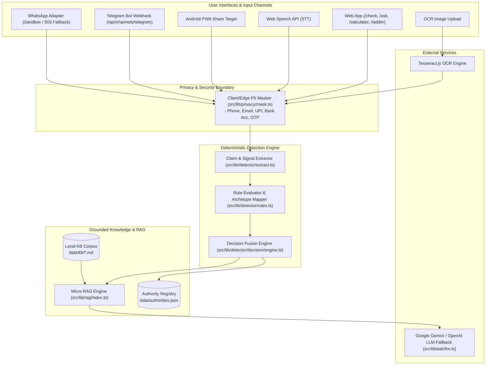
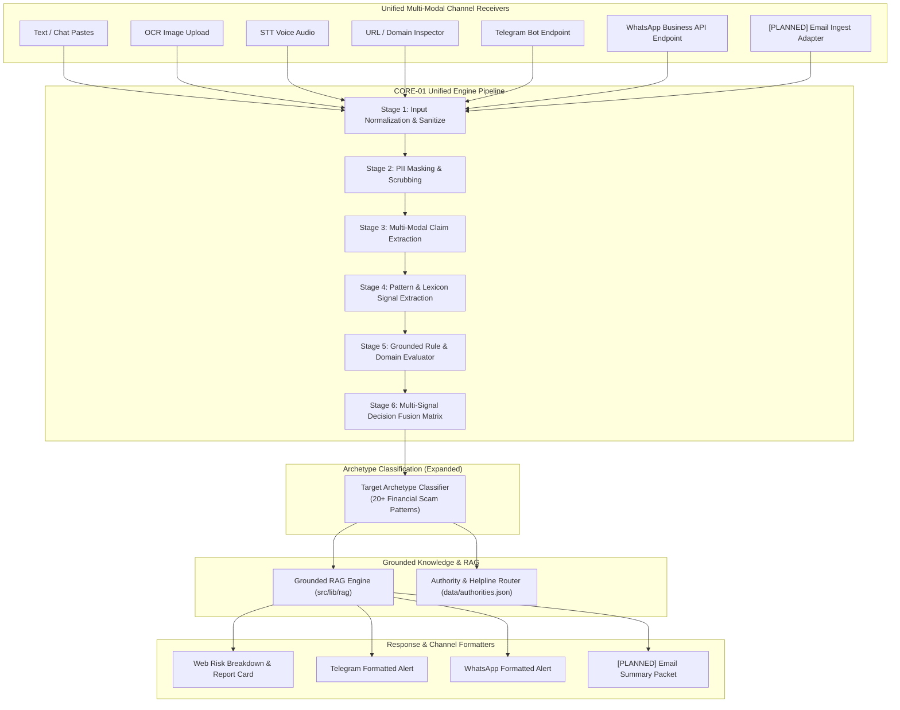

# CORE Current & Target Architecture Map

**Project**: SANGYAN / ArgusFin (Investor Resilience Infrastructure)  
**Task**: CORE-01A Architecture & Pipeline Audit  
**Date**: October 3, 2026  

---

## 1. Actual Current Architecture Diagram

The diagram below reflects **strictly implemented** components currently in `src/` and `data/`:

---

## 2. Planned Target Architecture Diagram (CORE-01 Engine)

The diagram below maps how the existing infrastructure will evolve into the unified **CORE-01 Scam Detection Engine**. All future/unbuilt modules are explicitly marked **`[PLANNED]`**.

---

## 3. End-to-End Pipeline Stage Documentation

| Stage | Responsible Component / File | Input | Output | Safety & Privacy Enforcement |
|---|---|---|---|---|
| **1. Normalization** | `src/lib/detector/extract.ts` | Raw string / OCR text / Transcript | Unicode-normalized UTF-8 string | Strips control characters, normalizes confusable homoglyphs. |
| **2. PII Masking** | `src/lib/privacy/mask.ts` | Normalized string | Anonymized string with `[PHONE_MASKED]`, etc. | 100% client/edge executed. Zero raw PII leaves browser/channel receiver. |
| **3. Claim Extraction** | `src/lib/detector/extract.ts` | Anonymized string | Extracted claims (Return %, Timeframe, Guaranteed flags) | RegEx parsing with numerical extraction validation. |
| **4. Signal Extraction** | `src/lib/detector/rules.ts` | Extracted claims | Match signals & weights | Match against verified financial scam lexicons. |
| **5. Decision Fusion** | `src/lib/detector/decision/engine.ts` | Signals + Claims | Risk Band (`HIGH_RISK`, `MEDIUM_RISK`, `NO_RED_FLAGS`) | Mathematical score thresholding. Never returns "SAFE". |
| **6. LLM Explanation** | `src/lib/ask/llm.ts` | Risk Band + Masked Claims | Grounded concise explanation + citations | RAG context injection. Strict prompt ban on financial advice. |

---

## 4. LLM Usage & Prompt Inventory

| Location | Provider | Model | Purpose | Input Sent | Output Format | Grounding Constraint |
|---|---|---|---|---|---|---|
| `src/lib/ask/llm.ts` | Google Gemini / OpenAI | `gemini-1.5-flash` / `gpt-4o-mini` | Grounded explanation for scam checks & RAG QA | Masked text + RAG chunks | Structured JSON (`explanation`, `citations`, `band`) | Strictly grounded in `data/kb/` |
| `src/app/api/ask/route.ts` | Google Gemini / OpenAI | `gemini-1.5-flash` / `gpt-4o-mini` | Interactive Q&A conversational responses | Masked user prompt + context | Markdown stream / JSON | No investment advice, no stock tips |

---

## 5. Navigation & Deep-Link Audit Matrix

| Route Target | Purpose / Page | Semantic Target (`href` / Action) | Status |
|---|---|---|---|
| `/` | Homepage Hero & Features | Main Navigation / CTA links | **AVAILABLE** |
| `/check` | Multi-channel Scam Checker | Header, Footer, Hero CTA | **AVAILABLE** |
| `/ask` | Grounded RAG Assistant | Header & Quick Actions | **AVAILABLE** |
| `/calculator` | CAGR & Realistic Return Calculator | Navigation bar & Tools dropdown | **AVAILABLE** |
| `/ladder` | Risk Ladder & Archetypes | Tools & Educational Links | **AVAILABLE** |
| `/authorities` | Verified Helplines & Contacts | Emergency banner & Footer | **AVAILABLE** |
| `/report` | Evidence & Incident Reporting | Secondary navigation | **AVAILABLE** |
